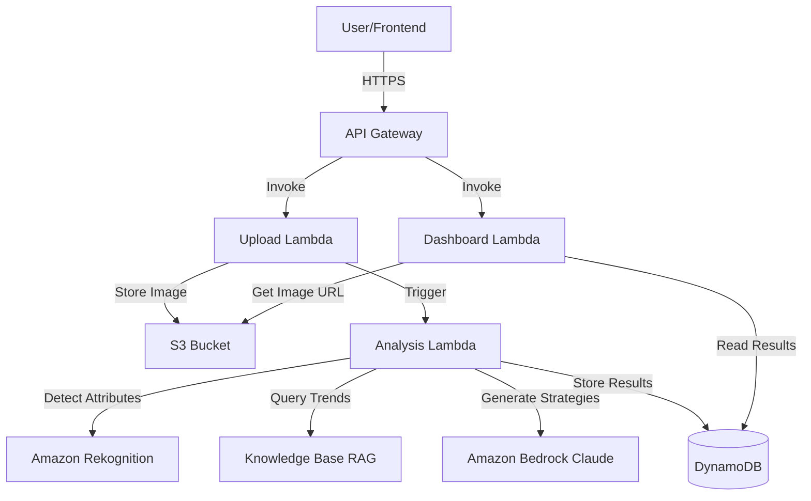

# Design Document: Waste2Wardrobe

## Overview

Waste2Wardrobe is a serverless, cloud-native application built on AWS that combines computer vision and large language model reasoning to help Indian fashion businesses reduce unsold inventory waste. The system follows an event-driven architecture where product uploads trigger a pipeline of AI analysis services that generate actionable reuse strategies with sustainability impact metrics.

The design emphasizes:
- **Serverless scalability** using AWS Lambda and API Gateway
- **AI-powered intelligence** through Amazon Bedrock (Claude) and Rekognition
- **Knowledge-augmented reasoning** via RAG with fashion trend data
- **Modular service boundaries** for independent scaling and maintenance
- **Security-first approach** with encryption and access controls

## Architecture

### High-Level Architecture



### Service Boundaries

The system is divided into three primary service domains:

1. **Ingestion Service** - Handles product uploads, validation, and storage
2. **Analysis Service** - Orchestrates AI pipeline (vision → knowledge → reasoning)
3. **Presentation Service** - Retrieves and formats results for dashboard display

Each service operates independently with clear interfaces, enabling parallel development and independent scaling.

## Components and Interfaces

### 1. API Gateway

**Purpose**: Single entry point for all HTTP requests with authentication and rate limiting.

**Endpoints**:
- `POST /inventory` - Upload new inventory item
- `GET /inventory/{id}` - Retrieve analysis results
- `GET /inventory/{id}/dashboard` - Get formatted dashboard data

**Configuration**:
- CORS enabled for web frontend
- Request validation for required fields
- API key authentication
- Rate limiting: 100 requests per minute per user

### 2. Upload Lambda

**Purpose**: Process inventory uploads, validate input, store images, and trigger analysis.

**Input**:
```json
{
  "image": "base64-encoded-image-data",
  "category": "shirt|saree|kurti|denim|...",
  "quantity": 100,
  "region": "Mumbai|Delhi|Bangalore|...",
  "timeUnsold": 90
}
```

**Processing Logic**:
1. Validate required fields (category, quantity, region, timeUnsold)
2. Validate image format and size (max 5MB)
3. Generate unique inventory ID (UUID)
4. Upload image to S3 with key: `inventory/{id}/product.jpg`
5. Create initial DynamoDB record with status "pending"
6. Invoke Analysis Lambda asynchronously
7. Return inventory ID to user

**Output**:
```json
{
  "inventoryId": "uuid",
  "status": "pending",
  "message": "Analysis in progress"
}
```

**Error Handling**:
- Invalid image format → 400 Bad Request
- Missing required fields → 400 Bad Request
- S3 upload failure → 500 Internal Server Error with retry

### 3. Analysis Lambda

**Purpose**: Orchestrate the AI analysis pipeline from image detection through strategy generation.

**Input** (from Upload Lambda):
```json
{
  "inventoryId": "uuid",
  "s3Key": "inventory/{id}/product.jpg",
  "category": "shirt",
  "quantity": 100,
  "region": "Mumbai",
  "timeUnsold": 90
}
```

**Processing Pipeline**:

**Step 1: Image Analysis**
- Retrieve image from S3
- Call Rekognition DetectLabels API
- Call Rekognition DetectText API (for any text on garment)
- Extract: garment type, colors, patterns, fabric texture indicators
- Store attributes in DynamoDB

**Step 2: Knowledge Retrieval**
- Query RAG Knowledge Base with:
  - Detected garment attributes
  - User-provided category and region
  - Current season (derived from timestamp)
- Retrieve: fashion trends, regional preferences, seasonal data, sustainability benchmarks

**Step 3: Market Analysis**
- Construct prompt for Bedrock:
```
Analyze why this product is unsold:
- Product: {category}, {colors}, {patterns}
- Region: {region}
- Time unsold: {timeUnsold} days
- Trends: {rag_trends}
- Seasonal data: {rag_seasonal}

Provide a concise explanation of likely reasons for low sales.
```
- Call Bedrock with Claude model
- Store explanation in DynamoDB

**Step 4: Strategy Generation**
- Construct prompt for Bedrock:
```
Generate reuse strategies for:
- Product: {category}, {attributes}
- Quantity: {quantity}
- Region: {region}
- Market analysis: {explanation}

For each strategy (redesign, repurpose, resale, redistribution):
- Effort level (Low/Medium/High)
- Cost estimate (INR)
- Expected resale value (INR)
- Sustainability benefit (waste/carbon/water saved)

Rank by profit recovery potential.
```
- Call Bedrock with Claude model
- Parse structured response into strategy objects

**Step 5: Sustainability Calculation**
- For each strategy, calculate metrics:
  - Waste reduction = quantity × average_garment_weight × reuse_percentage
  - Carbon savings = waste_reduction × carbon_per_kg (from Knowledge Base)
  - Water savings = waste_reduction × water_per_kg (from Knowledge Base)
  - Landfill reduction = waste_reduction × landfill_percentage
- Store metrics with each strategy

**Step 6: Finalization**
- Update DynamoDB record with status "completed"
- Store all analysis results and strategies

**Output** (stored in DynamoDB):
```json
{
  "inventoryId": "uuid",
  "status": "completed",
  "attributes": {
    "garmentType": "shirt",
    "colors": ["blue", "white"],
    "patterns": ["striped"]
  },
  "marketAnalysis": {
    "explanation": "Product shows traditional striped pattern..."
  },
  "strategies": [
    {
      "type": "redesign",
      "description": "Convert to modern slim-fit...",
      "effortLevel": "Medium",
      "costEstimate": 5000,
      "expectedResaleValue": 15000,
      "profitRecovery": 10000,
      "sustainability": {
        "wasteReduction": 50,
        "carbonSavings": 25,
        "waterSavings": 1000,
        "landfillReduction": 45
      }
    }
  ],
  "bestStrategy": 0,
  "totalSustainabilityImpact": {...}
}
```

**Error Handling**:
- Rekognition failure → Retry 3 times, then mark as "analysis_failed"
- Bedrock failure → Retry 3 times, then mark as "analysis_failed"
- RAG unavailable → Use cached trend data, log warning
- Any failure → Update DynamoDB status to "failed" with error message

### 4. Dashboard Lambda

**Purpose**: Retrieve and format analysis results for user-friendly dashboard display.

**Input**:
```
GET /inventory/{id}/dashboard
```

**Processing Logic**:
1. Query DynamoDB for inventory item by ID
2. Check status: pending/completed/failed
3. If completed, retrieve S3 signed URL for image (1-hour expiration)
4. Format response with best strategy highlighted
5. Include all alternative strategies ranked by profit

**Output**:
```json
{
  "inventoryId": "uuid",
  "status": "completed",
  "imageUrl": "https://s3-signed-url...",
  "productInfo": {
    "category": "shirt",
    "quantity": 100,
    "region": "Mumbai",
    "timeUnsold": 90
  },
  "detectedAttributes": {
    "garmentType": "shirt",
    "colors": ["blue", "white"],
    "patterns": ["striped"]
  },
  "whyNotSelling": "Product shows traditional striped pattern...",
  "bestStrategy": {
    "type": "redesign",
    "description": "Convert to modern slim-fit...",
    "effortLevel": "Medium",
    "costEstimate": 5000,
    "expectedResaleValue": 15000,
    "profitRecovery": 10000,
    "sustainability": {
      "wasteReduction": "50 kg",
      "carbonSavings": "25 kg CO2",
      "waterSavings": "1000 liters",
      "landfillReduction": "45 kg"
    }
  },
  "alternativeStrategies": [...]
}
```

**Error Handling**:
- Item not found → 404 Not Found
- Analysis pending → 202 Accepted with status message
- Analysis failed → 500 with error details

### 5. Amazon S3

**Purpose**: Secure storage for product images.

**Bucket Configuration**:
- Bucket name: `waste2wardrobe-inventory-{environment}`
- Encryption: AES-256 server-side encryption
- Versioning: Enabled
- Lifecycle policy: Archive to Glacier after 90 days
- Access: Private (only Lambda execution roles)

**Object Structure**:
```
inventory/
  {uuid}/
    product.jpg
```

### 6. Amazon DynamoDB

**Purpose**: Store inventory metadata, analysis results, and strategies.

**Table**: `Waste2Wardrobe-Inventory`

**Primary Key**:
- Partition Key: `inventoryId` (String, UUID)

**Attributes**:
```
{
  "inventoryId": "uuid",
  "userId": "user-id",
  "status": "pending|completed|failed",
  "createdAt": "ISO-8601-timestamp",
  "updatedAt": "ISO-8601-timestamp",
  "s3Key": "inventory/{id}/product.jpg",
  "category": "shirt",
  "quantity": 100,
  "region": "Mumbai",
  "timeUnsold": 90,
  "attributes": {...},
  "marketAnalysis": {...},
  "strategies": [...],
  "bestStrategy": 0,
  "totalSustainabilityImpact": {...},
  "errorMessage": "optional-error-details"
}
```

**Indexes**:
- GSI: `userId-createdAt-index` for user's inventory list

**Capacity**:
- On-demand billing mode for automatic scaling

### 7. Amazon Rekognition

**Purpose**: Computer vision analysis for garment attribute detection.

**APIs Used**:
- `DetectLabels`: Identify garment type, colors, patterns
- `DetectText`: Extract any text on garments

**Configuration**:
- MinConfidence: 70% for label detection
- MaxLabels: 20 labels per image

**Expected Labels**:
- Garment types: Shirt, T-Shirt, Dress, Saree, Kurti, Denim, etc.
- Colors: Blue, Red, White, Black, etc.
- Patterns: Striped, Floral, Plain, Embroidered, etc.
- Attributes: Cotton, Silk, Casual, Formal, etc.

### 8. Amazon Bedrock (Claude)

**Purpose**: AI reasoning engine for market analysis and strategy generation.

**Model**: Claude 3 Sonnet (balance of speed and intelligence)

**Configuration**:
- Temperature: 0.7 (balanced creativity)
- Max tokens: 2000 per request
- Top-p: 0.9

**Prompt Engineering**:
- Use structured prompts with clear sections
- Request JSON-formatted responses for strategy generation
- Include few-shot examples for consistent output format
- Incorporate RAG context explicitly in prompts

### 9. Knowledge Base (RAG)

**Purpose**: Provide fashion trend, regional preference, and sustainability data to enhance AI reasoning.

**Implementation**: Amazon Bedrock Knowledge Base with OpenSearch Serverless

**Data Sources**:
1. **Fashion Trends Database**
   - Seasonal trends by region
   - Popular styles and patterns
   - Color preferences by demographic
   - Updated quarterly

2. **Regional Market Data**
   - City-specific fashion preferences
   - Price sensitivity by region
   - Cultural considerations
   - Festival and seasonal calendars

3. **Sustainability Benchmarks**
   - Carbon footprint per kg of textile
   - Water consumption per kg
   - Industry standard conversion factors
   - Circular economy best practices

**Query Process**:
1. Embed query using Bedrock embedding model
2. Retrieve top 5 relevant documents from OpenSearch
3. Include retrieved context in Bedrock prompts

**Data Format** (example):
```json
{
  "type": "trend",
  "region": "Mumbai",
  "season": "Summer 2024",
  "popularStyles": ["minimalist", "sustainable", "indo-western"],
  "popularColors": ["pastels", "earth tones"],
  "avoidPatterns": ["heavy embroidery", "dark colors"]
}
```

## Data Models

### InventoryItem

```typescript
interface InventoryItem {
  inventoryId: string;           // UUID
  userId: string;                // User identifier
  status: 'pending' | 'completed' | 'failed';
  createdAt: string;             // ISO-8601
  updatedAt: string;             // ISO-8601
  s3Key: string;                 // S3 object key
  
  // User-provided data
  category: string;              // shirt, saree, kurti, etc.
  quantity: number;              // Units unsold
  region: string;                // Mumbai, Delhi, etc.
  timeUnsold: number;            // Days
  
  // Analysis results
  attributes?: GarmentAttributes;
  marketAnalysis?: MarketAnalysis;
  strategies?: ReuseStrategy[];
  bestStrategy?: number;         // Index of best strategy
  totalSustainabilityImpact?: SustainabilityMetrics;
  
  // Error tracking
  errorMessage?: string;
}
```

### GarmentAttributes

```typescript
interface GarmentAttributes {
  garmentType: string;           // Detected type
  colors: string[];              // Detected colors
  patterns: string[];            // Detected patterns
  textOnGarment?: string[];      // Any text detected
  confidence: number;            // Overall confidence score
}
```

### MarketAnalysis

```typescript
interface MarketAnalysis {
  explanation: string;           // Why product isn't selling
  trendAlignment: 'high' | 'medium' | 'low';
  seasonalMismatch: boolean;
  regionalDemand: 'high' | 'medium' | 'low';
  exportSurplusRelevance: boolean;
}
```

### ReuseStrategy

```typescript
interface ReuseStrategy {
  type: 'redesign' | 'repurpose' | 'resale' | 'redistribution';
  description: string;           // Detailed strategy description
  effortLevel: 'Low' | 'Medium' | 'High';
  costEstimate: number;          // INR
  expectedResaleValue: number;   // INR
  profitRecovery: number;        // expectedResaleValue - costEstimate
  sustainability: SustainabilityMetrics;
  actionSteps?: string[];        // Optional implementation steps
}
```

### SustainabilityMetrics

```typescript
interface SustainabilityMetrics {
  wasteReduction: number;        // kg
  carbonSavings: number;         // kg CO2
  waterSavings: number;          // liters
  landfillReduction: number;     // kg
}
```

## Error Handling

### Error Categories

1. **Validation Errors** (4xx)
   - Missing required fields
   - Invalid image format
   - Invalid enum values
   - Response: 400 Bad Request with field-specific messages

2. **Authentication Errors** (4xx)
   - Invalid API key
   - Expired token
   - Response: 401 Unauthorized

3. **Resource Errors** (4xx)
   - Inventory item not found
   - Response: 404 Not Found

4. **Service Errors** (5xx)
   - Rekognition unavailable
   - Bedrock throttling
   - S3 upload failure
   - DynamoDB write failure
   - Response: 500 Internal Server Error with retry guidance

### Retry Strategy

**Exponential Backoff**:
- Initial delay: 1 second
- Maximum retries: 3
- Backoff multiplier: 2
- Maximum delay: 8 seconds

**Retryable Operations**:
- Rekognition API calls
- Bedrock API calls
- DynamoDB writes
- S3 uploads

**Non-Retryable Errors**:
- Validation errors
- Authentication errors
- Malformed requests

### Error Response Format

```json
{
  "error": {
    "code": "ANALYSIS_FAILED",
    "message": "Image analysis service temporarily unavailable",
    "retryable": true,
    "details": {
      "service": "Rekognition",
      "attemptedRetries": 3
    }
  }
}
```

### Monitoring and Alerting

**CloudWatch Metrics**:
- Lambda invocation count and duration
- Error rate by Lambda function
- Rekognition API call success rate
- Bedrock API call success rate
- DynamoDB read/write capacity

**CloudWatch Alarms**:
- Error rate > 5% for 5 minutes → Alert
- Lambda duration > 25 seconds → Warning
- DynamoDB throttling → Alert

**CloudWatch Logs**:
- All Lambda functions log to dedicated log groups
- Structured JSON logging for easy querying
- Log retention: 30 days

## Testing Strategy

The testing strategy employs both unit tests and property-based tests to ensure comprehensive coverage of the Waste2Wardrobe system.

### Unit Testing

Unit tests focus on:
- **Validation logic**: Test specific examples of valid/invalid inputs
- **Data transformation**: Test conversion between formats
- **Error conditions**: Test specific error scenarios
- **Integration points**: Test AWS service mocking and responses
- **Edge cases**: Empty strings, boundary values, special characters

**Framework**: Jest (for Node.js Lambda functions)

**Coverage Target**: 80% code coverage

**Example Unit Tests**:
- Upload Lambda validates missing category field
- Dashboard Lambda returns 404 for non-existent inventory ID
- Analysis Lambda handles Rekognition confidence below threshold
- Sustainability calculation with zero quantity returns zero metrics

### Property-Based Testing

Property-based tests verify universal correctness properties across many generated inputs. Each property test runs a minimum of 100 iterations with randomized inputs.

**Framework**: fast-check (JavaScript property-based testing library)

**Test Configuration**:
- Minimum 100 iterations per property
- Each test tagged with: `Feature: waste2wardrobe, Property {N}: {description}`
- Generators for: inventory items, garment attributes, strategies, metrics

### Integration Testing

**API Integration Tests**:
- End-to-end flow: upload → analysis → dashboard retrieval
- Test with real AWS services in staging environment
- Verify S3 image storage and retrieval
- Verify DynamoDB record creation and updates

**AWS Service Mocking**:
- Use AWS SDK mocks for unit tests
- Use LocalStack for local integration testing
- Use dedicated test AWS account for staging tests

### Performance Testing

**Load Testing**:
- Simulate 100 concurrent uploads
- Measure end-to-end latency
- Verify auto-scaling behavior
- Target: 95th percentile < 35 seconds for full analysis

**Tools**: Artillery or AWS Load Testing solution


## Correctness Properties

*A property is a characteristic or behavior that should hold true across all valid executions of a system—essentially, a formal statement about what the system should do. Properties serve as the bridge between human-readable specifications and machine-verifiable correctness guarantees.*

### Property 1: Image Upload and Storage

*For any* valid product image, when uploaded through the system, the image should be stored in S3 and retrievable using the generated inventory ID.

**Validates: Requirements 1.1, 1.4**

### Property 2: Input Validation Completeness

*For any* product metadata submission with missing required fields (category, quantity, region, or timeUnsold), the system should reject the request and return an error message that specifically identifies which fields are missing.

**Validates: Requirements 1.2, 1.3**

### Property 3: Unique Identifier Assignment

*For any* set of inventory items created, all assigned inventory IDs should be unique with no duplicates.

**Validates: Requirements 1.5**

### Property 4: Attribute Extraction and Storage

*For any* successful Rekognition analysis, the extracted garment attributes (type, colors, patterns) should be stored in the DynamoDB record and retrievable via the inventory ID.

**Validates: Requirements 2.2, 2.4**

### Property 5: Service Orchestration

*For any* inventory item with a stored image, the system should invoke both Vision_Service for image analysis and Knowledge_Base for trend data retrieval before generating strategies.

**Validates: Requirements 2.1, 3.1**

### Property 6: Market Analysis Generation

*For any* inventory item with complete attributes and trend data, the system should generate a non-empty human-readable explanation of why the product is not selling and store it with the inventory record.

**Validates: Requirements 3.3, 3.4**

### Property 7: Strategy Completeness

*For any* generated reuse strategy, the strategy object should contain all required fields: type, description, effortLevel, costEstimate, expectedResaleValue, profitRecovery, and sustainability metrics.

**Validates: Requirements 4.1, 4.2**

### Property 8: Strategy Ranking

*For any* set of multiple reuse strategies, the strategies should be sorted in descending order by profitRecovery value, with the highest profit strategy ranked first.

**Validates: Requirements 4.3**

### Property 9: Sustainability Metrics Completeness

*For any* reuse strategy, the sustainability metrics should include all four required values: wasteReduction, carbonSavings, waterSavings, and landfillReduction, all with non-negative numeric values.

**Validates: Requirements 5.1, 5.3**

### Property 10: Sustainability Calculation Accuracy

*For any* reuse strategy with known quantity and conversion factors, the calculated sustainability metrics should equal quantity × conversion_factor for each metric type.

**Validates: Requirements 5.2**

### Property 11: Sustainability Aggregation

*For any* inventory item with multiple strategies, the total sustainability impact should equal the sum of individual strategy sustainability metrics across all four metric types.

**Validates: Requirements 5.4**

### Property 12: Dashboard Response Completeness

*For any* completed inventory item, the dashboard response should include: imageUrl, productInfo, detectedAttributes, whyNotSelling explanation, bestStrategy with all fields, and alternativeStrategies array sorted by profit recovery.

**Validates: Requirements 6.1, 6.2, 6.3, 6.4, 6.5**

### Property 13: User Data Isolation

*For any* dashboard request with a specific userId, the returned data should only include inventory items where the stored userId matches the requesting userId.

**Validates: Requirements 7.4**

### Property 14: Retry Logic with Exponential Backoff

*For any* Vision_Service or Reasoning_Engine failure, the system should retry the request up to 3 times with exponential backoff (1s, 2s, 4s delays) before marking the analysis as failed.

**Validates: Requirements 9.1**

### Property 15: Error Notification

*For any* service failure after exhausting retries, the system should return an error response containing: error code, descriptive message, retryable flag, and service name that failed.

**Validates: Requirements 9.2, 9.4**

### Property 16: Data Preservation on Failure

*For any* upload that fails during processing, the original user-provided metadata (category, quantity, region, timeUnsold) should remain stored in the DynamoDB record with status "failed" for potential retry.

**Validates: Requirements 9.3**

